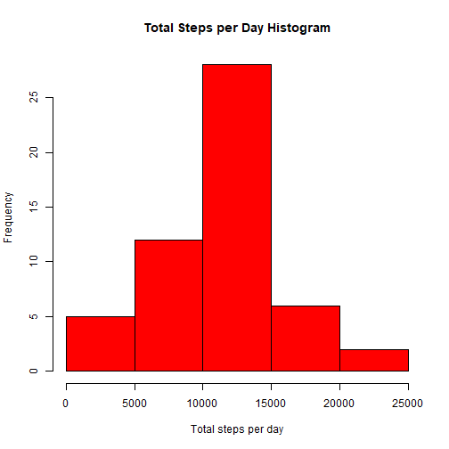
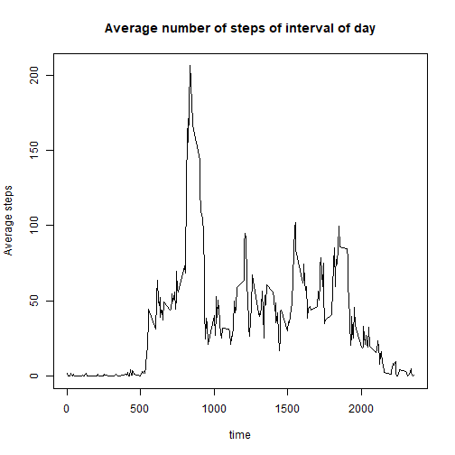
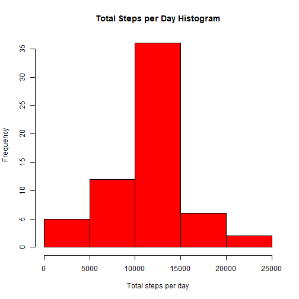
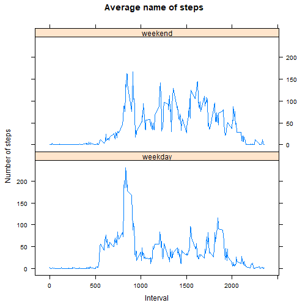

# Reproducible Research Course Project 1
===============================

First we download, unzip and read the file 

```r
url <- "https://d396qusza40orc.cloudfront.net/repdata%2Fdata%2Factivity.zip"
download.file(url, destfile = "activity.zip")
unzip("activity.zip")
activity<- read.csv("activity.csv")
```
## What is mean total number of steps taken per day?

We transform date variable into date format, claculate the sum of steps each day and make an histogram of the sum of steps for each day 


```r
activity$date <- as.Date(activity$date, format = "%Y-%m-%d")
steps_sum<- aggregate(steps ~ date, data = activity, sum)
hist(steps_sum$steps, 
     main = "Total Steps per Day Histogram", 
     xlab = "Total steps per day", col = "red")
```



```r
men <- mean(steps_sum$steps)
med <- median(steps_sum$steps)
```
The mean of total steps per day is 1.0766189 &times; 10<sup>4</sup> and the median of total steps per day is 10765. 

## What is the average daily activity pattern?

```r
steps_Int <- aggregate(steps ~ interval, data = activity, mean)
plot(steps_Int$interval, steps_Int$steps, main = "Average number of steps of interval of day", xlab = "time", ylab = "Average steps", type = "l")
```



```r
maxInt <- steps_Int[which.max(steps_Int$steps),1]
```

The 5-minute interval, that contains the maximum number of steps, on average across all the days in the dataset is interval no. 835. 

## Imputing missing values 

```r
sumNA<- sum(is.na(activity$steps))
```
There are 2304 missing values in the dataset. 
  
The missing values of the dataset are imputed, by replacing each one with the average number of steps for the respective time interval of the day and a new dataset that is equal to the original dataset but with the missing data filled in, is created.

```r
activity_imp <- activity
for(i in 1:length(activity_imp$steps)){
  if(is.na(activity_imp$steps[i])){
    activity_imp$steps[i] <- steps_Int[match(activity_imp$interval[i],steps_Int$interval),2]
  }}
```

A histogram of the total number of steps taken each day is made and the mean and median total number of steps taken per day are calculated. 

```r
activity_imp$date<- as.Date(activity_imp$date, format = "%Y-%m-%d")
steps_sum2<-aggregate( steps ~ date, data = activity_imp,sum)
hist(steps_sum2$steps, 
     main = "Total Steps per Day Histogram", 
     xlab = "Total steps per day", col = "red")
```



```r
men2 <- mean(steps_sum2$steps)
med2 <- median(steps_sum2$steps)
```
The mean of total steps per day is 1.0766189 &times; 10<sup>4</sup> and the median of total steps per day is 1.0766189 &times; 10<sup>4</sup>. 

Since the missing values were imputed by the mean number of steps per interval, there is no difference in mean before and after imputing which is not surprising. The median has increased a little. 
On the histogram we can see an increase to the frequency of the total number of steps per day, which is reasonable. 

## Are there differences in activity patterns between weekdays and weekends? 

First we add to the imputed data a column with a factor variable with the levels "weekday" and "weekend"


```r
weekday <- rep(0,length(activity_imp$date))
for(i in 1:length(activity_imp$date)){
  if(weekdays(activity_imp$date[i]) == "Saturday" | 
     weekdays(activity_imp$date[i]) == "Sunday"){
        weekday[i] <- "weekend"
  }else{
     weekday[i]<- "weekday"}
  
}
activity_imp <- cbind(activity_imp, weekday)
activity_imp$weekday <- as.factor(activity_imp$weekday)
```

A panel plot of the 5-minute interval and the average number of steps taken, averaged across all weekday days or weekend days. 


```r
library(lattice)
steps_Int2<- aggregate(steps ~ interval + weekday, data = activity_imp, mean)
p<- xyplot(steps_Int2$steps ~ steps_Int2$interval|steps_Int2$weekday,main = "Average name of steps", xlab = "Interval", ylab = "Number of steps", layout = c(1,2), type = "l")
print(p)
```



